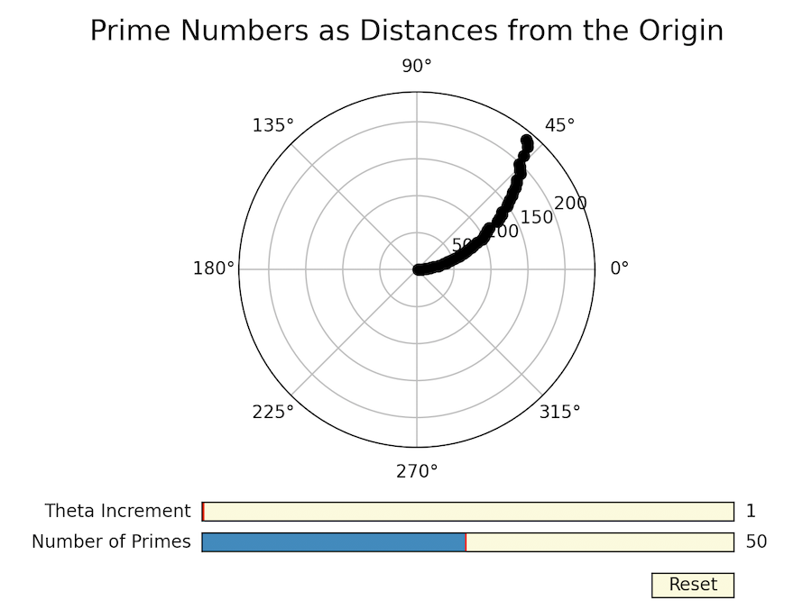
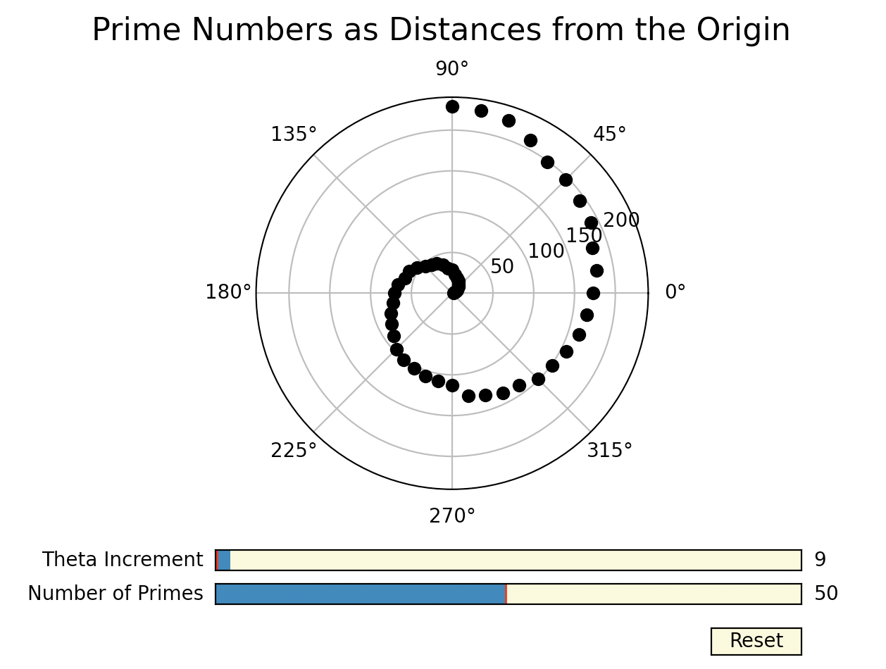
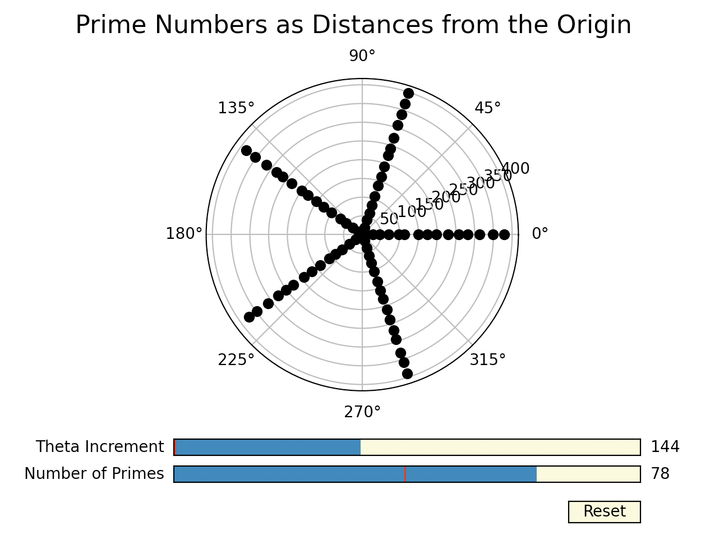
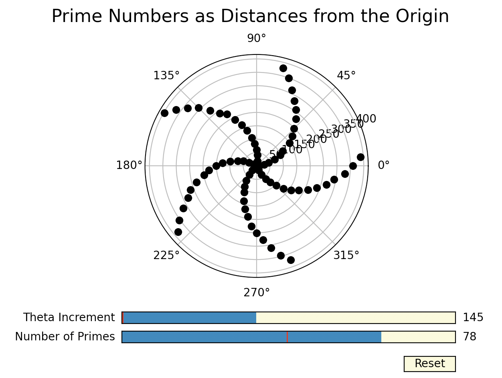
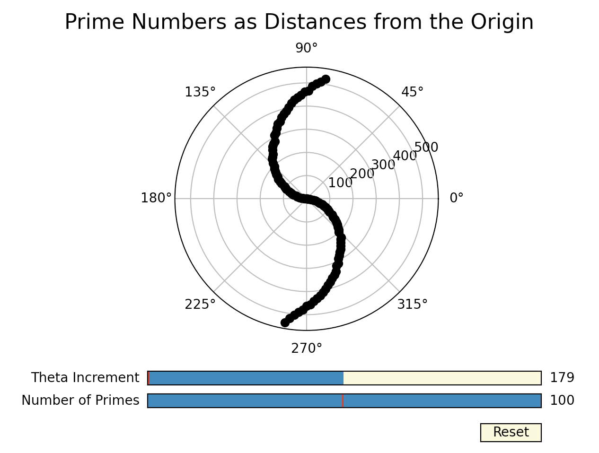

# Prime Number Polar Visualizer
Natasha Dada, Fall 2018

This visualizer, graphs prime numbers in a spiral using polar coordinates. Each prime number has a distance from the origin of its magnitude. It has two sliders, one to adjust the number of prime numbers graphed and one to adjust the angle between each prime number.

The default state is the first 50 prime numbers each one degree apart, as shown below. The reset button returds the graph to this default state.

The first 50 prime numbers plotted 1 degree apart:

The sliders can be adjusted to produce different graphs, as shown in the following examples.

The first 50 prime numbers plotted 9 degrees apart:

The first 78 prime numbers plotted 144 degrees apart:

The first 78 prime numbers plotted 145 degrees apart:

The first 100 prime numbers plotted 179 degrees apart:

While these seem like specific choices, these patterns occur for many different theta increments. 
